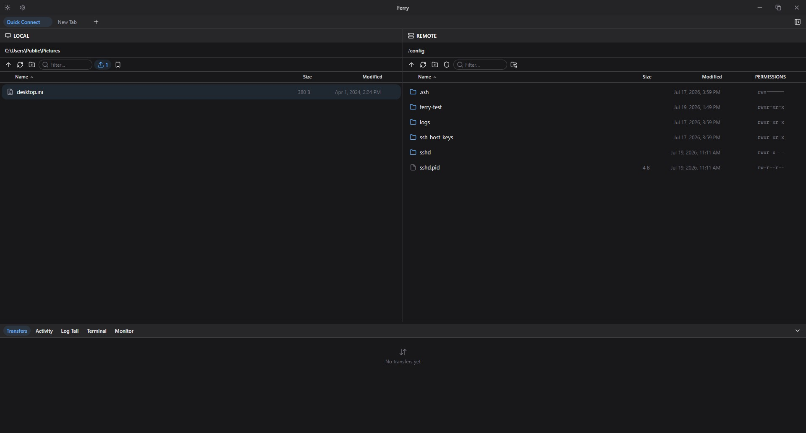
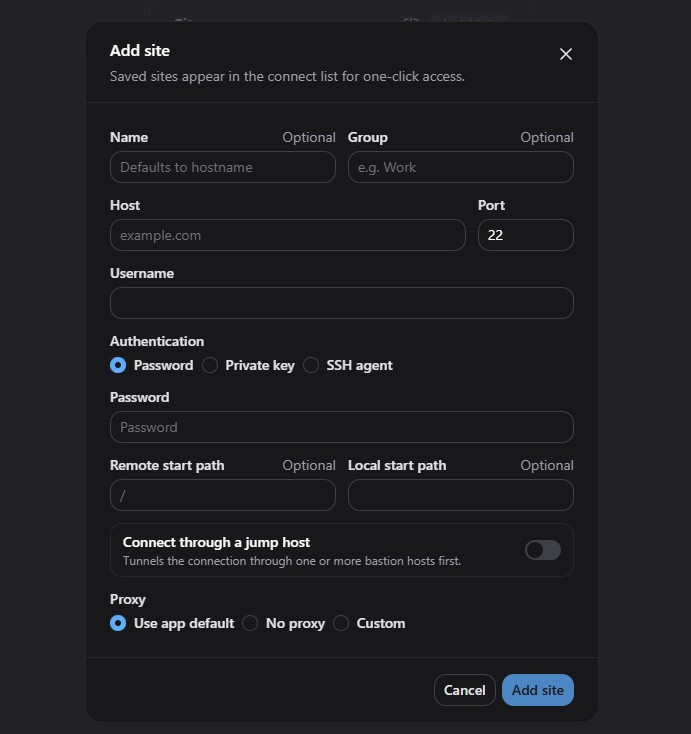
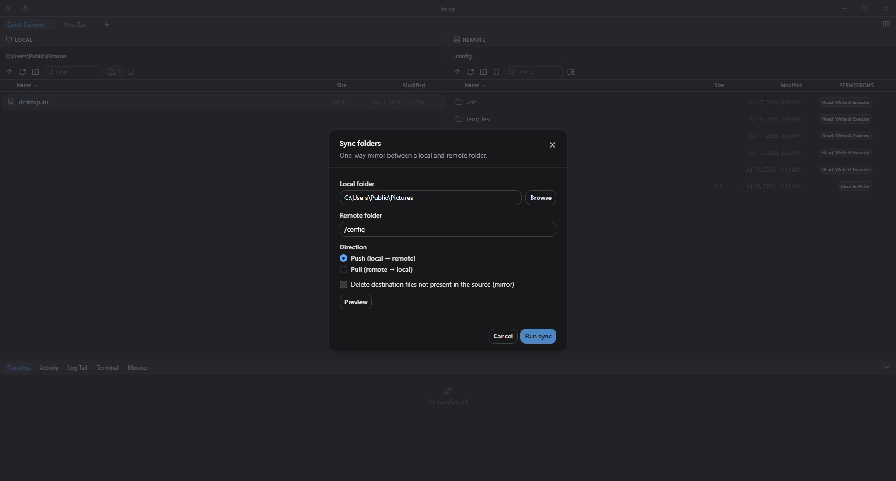
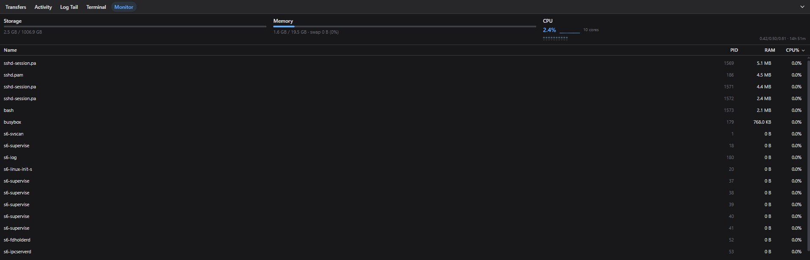
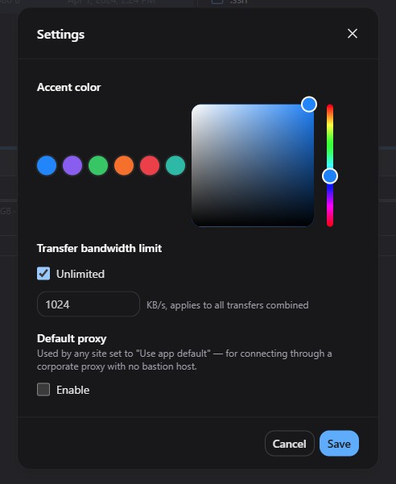

# Ferry

A lightweight WinSCP alternative: an Electron + Vue 3 desktop SFTP client. SSH/SFTP only — no
FTP/FTPS/SCP.

## Features

- Dual-pane local/remote file browser with sort, multi-select, and a right-click context menu
  (transfer, tail, extract, compress, rename, copy path, delete, chmod)
- Recursive folder transfers (upload/download whole directory trees), with retry on failure and an
  app-wide bandwidth cap
- OS drag-and-drop: drop files from Explorer onto the remote pane to upload, or drag rows out to
  Explorer/other apps
- Live remote log tailing (`tail -F`) and a text/archive file preview dialog
- Remote archive extract/compress, and local compress-to-zip
- Browser-like multi-session site tabs — connect to multiple servers at once, each with its own
  session, restored (as picker tabs) across restarts
- An interactive SSH Terminal per site, backed by `ssh2`'s PTY shell and `@xterm/xterm`
- A live remote resource Monitor (CPU/memory/load, disk usage, top processes) and an Activity dock
  tab showing progress for long-running operations
- Host-key verification (trust-on-first-use), SSH-agent and jump-host (bastion) authentication,
  real keyboard-interactive/2FA prompts
- Import existing WinSCP/PuTTY saved sessions (passwords are never imported)
- Command palette (Ctrl/Cmd+K), light/dark theme

## Screenshots

| | |
|---|---|
| **Dual-pane file browser** — local and remote side by side, with sort, multi-select, and per-file permissions. | **Flexible connections** — password, private key, or SSH agent auth, with jump-host and proxy support. |
|  |  |
| **One-way folder sync** — mirror a local folder to (or from) a remote one. | **Built-in resource monitor** — live CPU, memory, disk usage, and a top-processes table for the connected server. |
|  |  |

**Customizable** — accent color, transfer bandwidth cap, and default proxy settings.



## Installation

Download the latest Windows installer from this repository's
[Releases](https://github.com/ThienNg65/ferry/releases) page and run it. Ferry is currently
Windows-only.

## Development

```bash
npm install --registry=https://registry.npmjs.org
npm run dev          # electron-vite dev, hot reload
npm run typecheck    # type-check the whole project, no emit
npm run build        # electron-vite build -> out/
npm run package      # build + electron-builder -> dist/*.exe (NSIS) + dist/win-unpacked/
npm test             # vitest run (single pass)
```

See [CLAUDE.md](CLAUDE.md) and [.claude/PROJECT_MAP.md](.claude/PROJECT_MAP.md) for architecture,
conventions, and development notes.

## Releasing

CI (`.github/workflows/ci.yml`) runs typecheck + tests on every push/PR to `main`. On a successful
push to `main`, it also auto-tags `vX.Y.Z` if `package.json`'s version isn't already tagged.
Pushing that tag triggers `.github/workflows/release.yml`, which builds, packages, publishes the
installer to this repo's GitHub Releases via `electron-builder`, and fills in the release notes
from the commit history. So cutting a release is just: bump `package.json`'s `version` and
`VERSION` together, add a `CHANGELOG.md` entry, and merge to `main` — everything after that is
automatic. A signed build needs `CSC_LINK`/`CSC_KEY_PASSWORD` set as repo secrets; without them,
the workflow still publishes an unsigned installer.

## License

[MIT](LICENSE)
