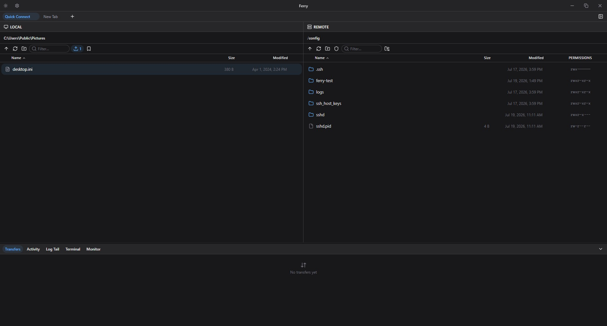
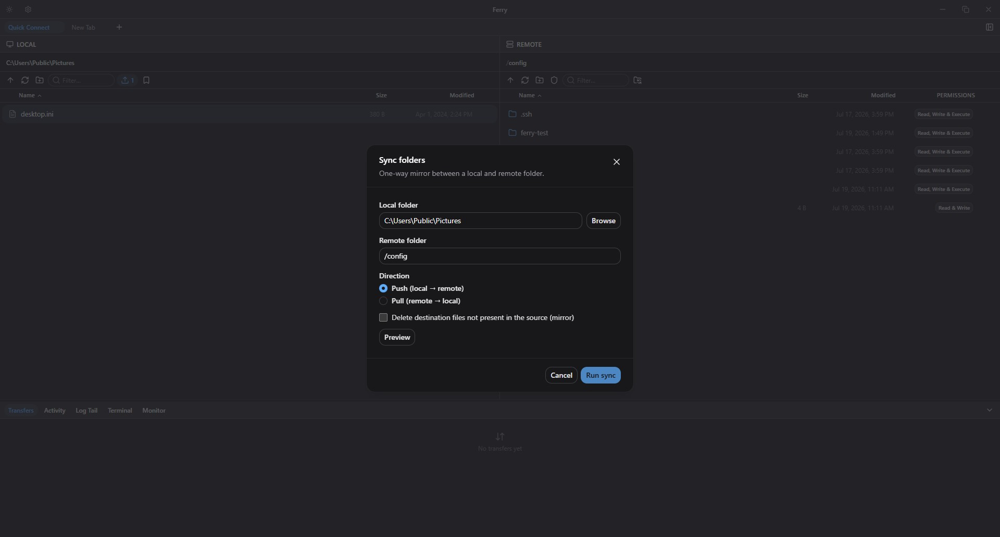
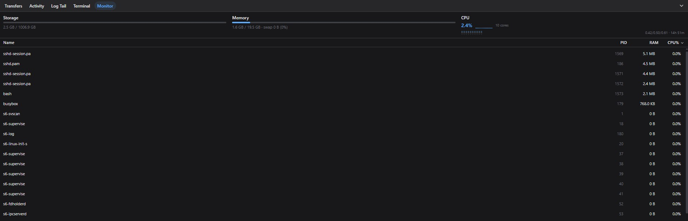
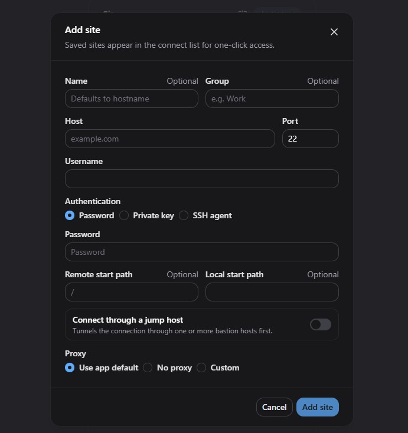
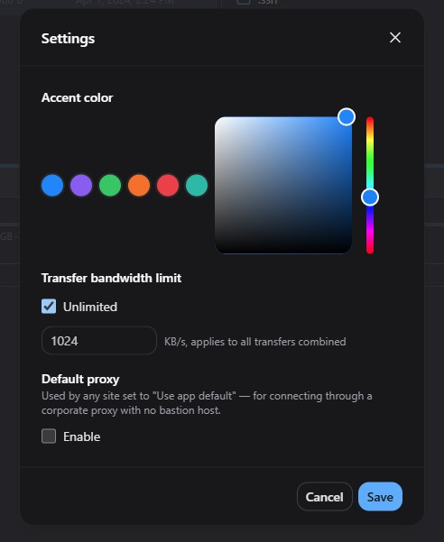

# Ferry

A lightweight WinSCP alternative: an Electron + Vue 3 desktop SFTP client. SSH/SFTP only — no
FTP/FTPS/SCP.

## Features

- Dual-pane local/remote file browser with sort, multi-select, and a right-click context menu
  (transfer, tail, extract, compress, rename, copy path, delete, chmod)
- Recursive folder transfers (upload/download whole directory trees), with retry on failure and an
  app-wide bandwidth cap
- OS drag-and-drop: drop files from Explorer onto the remote pane to upload, or drag rows out to
  Explorer/other apps
- Live remote log tailing (`tail -F`) and a text/archive file preview dialog
- Remote archive extract/compress, and local compress-to-zip
- Browser-like multi-session site tabs — connect to multiple servers at once, each with its own
  session, restored (as picker tabs) across restarts
- An interactive SSH Terminal per site, backed by `ssh2`'s PTY shell and `@xterm/xterm`
- A live remote resource Monitor (CPU/memory/load, disk usage, top processes) and an Activity dock
  tab showing progress for long-running operations
- Host-key verification (trust-on-first-use), SSH-agent and jump-host (bastion) authentication,
  real keyboard-interactive/2FA prompts
- Import existing WinSCP/PuTTY saved sessions (passwords are never imported)
- Command palette (Ctrl/Cmd+K), light/dark theme

## Screenshots

**Dual-pane file browser** — local and remote side by side, with sort, multi-select, and per-file permissions.



**One-way folder sync** — mirror a local folder to (or from) a remote one.



**Built-in resource monitor** — live CPU, memory, disk usage, and a top-processes table for the connected server.



| **Flexible connections** — password, private key, or SSH agent auth, with jump-host and proxy support. | **Customizable** — accent color, transfer bandwidth cap, and default proxy settings. |
|---|---|
|  |  |

## Installation

Download the latest Windows installer from this repository's
[Releases](https://github.com/ThienNg65/ferry/releases) page and run it. Ferry is currently
Windows-only. Every push to `main` publishes a new release automatically.

The installer is currently **unsigned**, so Windows SmartScreen will warn on first run — this is
expected, not a sign of tampering. Ferry's release pipeline (`.github/workflows/ci.yml`) has a
dormant signing stage ready to go live via [SignPath](https://signpath.io)'s free open-source
Authenticode signing program the moment that application is approved; see
`.claude/plan/ferry-smartscreen-signing-plan.md` for the full plan.

## Development

```bash
npm install --registry=https://registry.npmjs.org
npm run dev          # electron-vite dev, hot reload
npm run typecheck    # type-check the whole project, no emit
npm run build        # electron-vite build -> out/
npm run package      # build + electron-builder -> dist/*.exe (NSIS) + dist/win-unpacked/
npm test             # vitest run (single pass)
```

See [CLAUDE.md](CLAUDE.md) and [.claude/PROJECT_MAP.md](.claude/PROJECT_MAP.md) for architecture,
conventions, and development notes.

## Releasing

CI is a single workflow, `.github/workflows/ci.yml`. Every push/PR to `main` runs the `verify` job
(typecheck + tests + build). On a successful push to `main`, the `auto-release` job also runs the
whole release pipeline in one linear job: finalize `CHANGELOG.md`'s `## Unreleased` heading, tag
`vX.Y.Z` locally, build and package the app with `electron-builder` (unsigned), generate release
notes from `CHANGELOG.md` (via `.github/scripts/extract-release-notes.js`, not the commit history),
bump `package.json`/`VERSION` to the next patch version and commit that as the start of the next
development cycle, push the commits and the tag together, then create the GitHub Release and upload
the installer/blockmap/`latest.yml`. So cutting a release is just: bump `package.json`'s `version`
and `VERSION` together, add a `CHANGELOG.md` entry, and merge to `main` — everything after that is
automatic.

Signing goes through a currently-dormant SignPath stage rather than `electron-builder`'s native
`CSC_LINK`/`CSC_KEY_PASSWORD` pickup: every step in that stage is gated on the
`SIGNPATH_ORGANIZATION_ID` repo variable, which isn't set yet, so today it's a no-op and every
release ships unsigned. Once a SignPath OSS account is approved and that variable (plus its
matching secrets) are added, the workflow uploads the built installer as an artifact, submits it to
SignPath for Authenticode signing, and regenerates `latest.yml`'s hash/size before publishing —
without touching anything else in this flow.

## License

[MIT](LICENSE)
